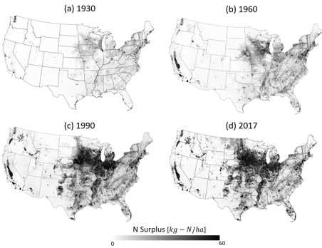

# gTREND-Nitrogen - Long-term nitrogen mass balance data for the contiguous United States (1930-2017)

This repository contains the codes associated with the manuscript titled **"gTREND-Nitrogen - Long-term nitrogen mass balance data for the contiguous United States (1930-2017)"**, currently in revision with *Scientific Data*.

The gTREND-Nitrogen dataset provides a comprehensive, long-term (1930-2017) nitrogen (N) mass balance for the contiguous United States at a spatial resolution of 250 meters. This dataset integrates county-scale estimates of N fluxes with gridded land use and population data to estimate grid-scale surface fluxes of N, including fertilizer, atmospheric deposition, manure inputs, biological N fixation, crop N uptake, and population-based human waste.

